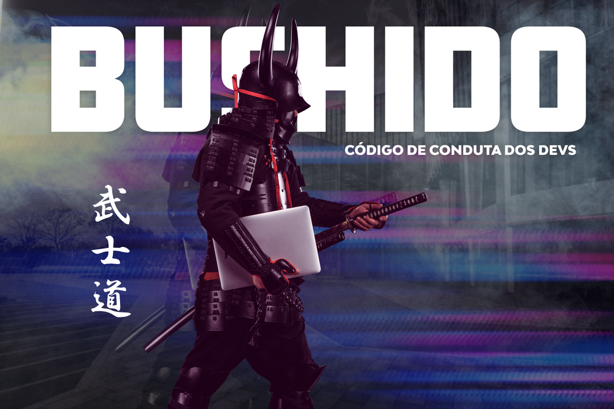

Código Bushido de Conduta para os Devs
=======================================================

Assim como um samurai você deve protejer a honra do seu projeto, e assim como eles um código de conduta deve ser seguido para assegurar que esse objetivo seja alcançado. 

Este manual estabelece uma série de normas e padrões a serem seguidas pela equipe de desenvolvimento, todos os pontos apresentados aqui visam uma melhor padronização em nossos projetos para assegurar não só a qualidade de nossas aplicações mas também a facilidade no onboarding de novos membros em um projeto.

Tópicos
-------------

- [Padronização de Projetos Laravel.](project-standards.md)
- [Criação de API's Rest.](rest-api.md)
- [Git e Git-Flow.](git-and-git-flow.md)
- [Fluxo de Testes.](test-flow.md)

Código Bitzen Bushido
-------------

A seguir algumas lições adaptadas dos princípios do **Bushido** para a nossa realidade. 

- **Honre** a si mesmo e a seu projeto, não permita que nem um nem outro sejam vistos com maus olhos pelo cliente.
- Seja **Homesto** em assumir seus erros, todos são suscetíveis a errar, o importante é aprender com o erro.
- Tenha **Coragem** de assumir novos desafios, a evolução não ocorrerá se você permanecer no seu lugar de conforto.
- Seja **Sincero** principalmente ao estimar uma tarefa desta forma conseguimos ser mais precisos em nossas entregas.
- Tenha **Autocontrole**, as vezes queremos dar um passo maior do que nossas pernas comportam, assuma riscos, porém saiba como medí-los corretamente antes.
- Permaneça **Leal** ao seu projeto e equipe, adote o princípio que se um erra todos erram e se um tem sucesso todos compartilham deste sucessso.

